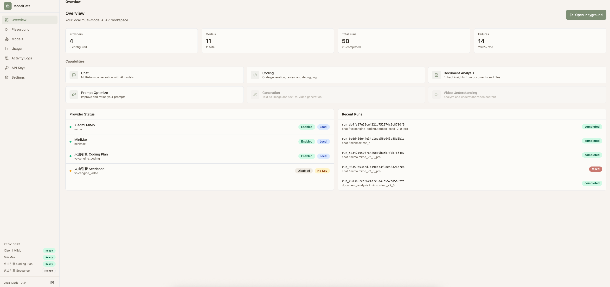
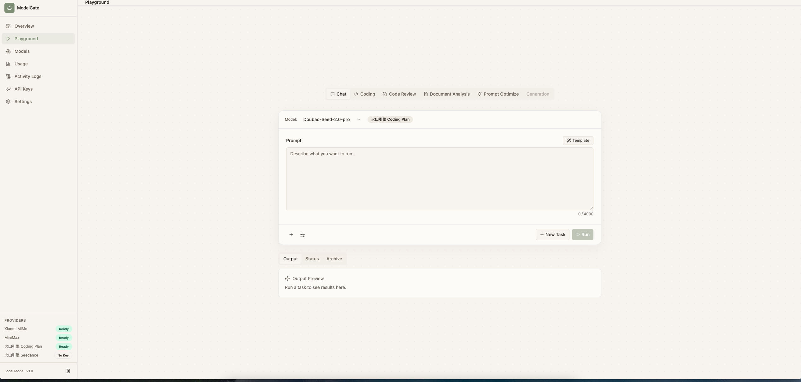
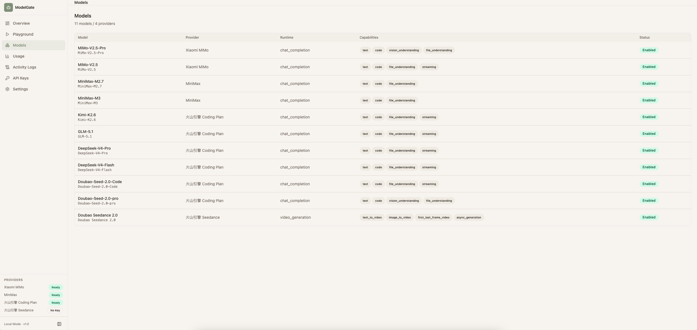
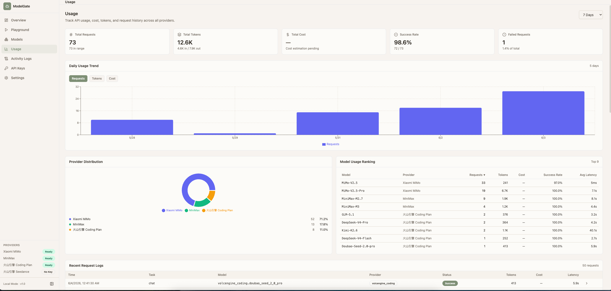

# ModelGate

> Local-first multi-model AI workspace for token plan APIs.

**[English](README.md)** · **[简体中文](README.zh-CN.md)**

ModelGate is a self-hosted, single-user AI workbench that unifies multiple
"token plan" providers (Xiaomi MiMo, MiniMax, Volcengine Coding Plan,
Volcengine Seedance, …) behind one capability-aware UI, one history, and
one set of safety guarantees. It is the missing layer between you and
your model subscriptions.

It is **not** an LLM proxy, an IDE plugin, a chat-only playground, or a
SaaS. It is a personal command center that turns "I have five token
plans" into "I can ask any of them anything, and trust what comes back."

---

## Why ModelGate

If you currently use one provider per browser tab, you already know the
pain: separate login flows, different parameter sets, no shared history,
no unified logs, no central place to inspect token usage or rotate a
leaked key. ModelGate collapses all of that:

| What you get | Why it matters |
|---|---|
| **One Adapter per protocol, one Config per model** | Add a new provider in `configs/*.json` + one Python file. No code changes anywhere else. |
| **Capability Router** | A model is selected by `taskType` + `inputTypes` + `outputTypes` + `enabled`, not by name. The UI never shows a model that cannot answer your request. |
| **Dynamic parameter panel** | Parameters are declared as JSON Schemas, not hard-coded. The form is rendered from the schema, including provider-specific mappings. |
| **Synchronous Chat Runtime + Async Generation Runtime** | One runtime for fast chat, another for slow video/image generation. They share the same storage, logging, and cancel path. |
| **Encrypted provider-key storage** | API keys written from the UI live in `provider_secrets` as AES-256-GCM ciphertext, derived from `MODELGATE_SECRET_KEY` via HKDF. Disk dump does not equal key leak. |
| **Streaming + cancel + idempotency** | All three work for both chat and generation. Streaming is real SSE; cancel propagates to the provider. |
| **End-to-end request IDs + log redaction** | Every entry in `request_logs` and `usage_logs` carries the same `requestId` you see in the response header. Authorization headers and absolute paths are auto-redacted. |
| **Storage Adapter** | Local filesystem today, S3/R2/OSS tomorrow. Business code never sees an absolute path. |
| **First-class file context** | Upload a PDF, DOCX, PPTX, XLSX, image, or code file; it is parsed, chunked, previewed, and inlined into the prompt with stable file IDs. Images can be sent as multimodal vision input on supported models. |
| **No login, no telemetry, no cloud** | Single-user local Postgres. You can audit every byte that leaves the box. |

---

## First version scope

- **No login.** Single user, local.
- **Local storage.** Postgres + Redis + filesystem. (S3-style storage is
  feature-flagged and ready to enable.)
- **Chat / coding models first.** Vision-capable models can already
  accept image inputs; the model registry filters by capability.
- **Providers in scope.** Xiaomi MiMo, MiniMax, Volcengine Coding Plan.
  Volcengine Seedance video generation is gated by
  `MODELGATE_ENABLE_SEEDANCE=true` and is fully implemented but
  off by default.
- **What is *not* in v1.** Workflows, multi-model compare, an
  OpenAI-compatible inbound endpoint, MCP server, and multi-tenant auth
  are reserved for Phase 10. The DB and feature flags are already
  shaped for them.

See [`docs/00-项目概览/第一版范围与开发决策.md`](docs/00-项目概览/第一版范围与开发决策.md)
for the full decision log.

---

## Architecture

```
Browser (Next.js 15 + Zustand + TanStack Query)
       │
       ▼
FastAPI ── ChatRuntime ─── ProviderAdapter ──► MiMo / MiniMax / Volcengine
       │                       │
       └── GenerationRuntime ──┴───► async (Celery worker)
                       │
                       ▼
Postgres · Redis · Storage Adapter (local now, S3-ready)
```

Read [`docs/02-技术设计/ArchitectureOverview.md`](docs/02-技术设计/ArchitectureOverview.md)
for the full request flows, data model, and deployment topology.

---

## Stack

- **Frontend:** Next.js 15 · TypeScript · Tailwind CSS · shadcn/ui · Zustand · TanStack Query · React Hook Form + Zod
- **Backend:** FastAPI · Pydantic · SQLAlchemy 2.x · Alembic · Celery · httpx
- **Data:** PostgreSQL 16 · Redis 7
- **Storage:** `app/services/storage.py` adapter (local today, pluggable)
- **CI:** GitHub Actions — ruff, pytest, alembic upgrade, ESLint, tsc, Next build, Playwright

---

## Screenshots

### Overview



The Overview dashboard surfaces everything you need to know about the
local installation: provider health, model count, run / failure
statistics, and the last few runs with status badges.

### Playground



The Playground is the work surface. Pick a task type (chat, coding,
code review, document analysis, prompt optimize, …), pick a model from
the ones that can answer it, and edit parameters rendered live from the
JSON Schema in `configs/param-schemas.json`.

### Models



Every model in the system is declared in `configs/models.json`. The
table is the same data the capability router uses to pick models, so
"what the UI shows" and "what runs" cannot drift apart.

### Usage



Usage analytics is sourced from `usage_logs` and `request_logs`: daily
token spend, provider distribution, per-model ranking, success rate,
and a recent request log with the same `requestId` you can grep in the
backend logs.

---

## Quick start

### 1. Copy and edit environment

```bash
cp .env.example .env
# Fill in at least one provider API key (e.g. MIMO_API_KEY=… or MINIMAX_API_KEY=…)
# Optional: set MODELGATE_ENABLE_SEEDANCE=true to enable Volcengine Seedance video generation
# Optional: set MODELGATE_SECRET_KEY=<random 32+ chars> for encrypted provider secret storage
```

> The app **starts** with all API keys empty — every provider will show
> "No Key" in the Providers panel, but the UI is fully navigable. Fill
> in at least one key to make real requests.

### 2. Start the full local stack with Docker Compose

```bash
docker compose up --build
```

- Frontend: <http://localhost:3000>
- Backend:  <http://localhost:8000>

If the default ports collide, override the host ports and API URL:

```bash
HOST_WEB_PORT=13000 \
HOST_API_PORT=18000 \
HOST_POSTGRES_PORT=15432 \
HOST_REDIS_PORT=16379 \
NEXT_PUBLIC_API_BASE_URL=http://localhost:18000/api \
CORS_ALLOW_ORIGINS=http://localhost:13000,http://127.0.0.1:13000 \
docker compose up --build
```

### 3. Manual development setup

```bash
# Start data services only
docker compose up -d postgres redis

# Backend (conda recommended)
conda create -n modelgate python=3.11
conda activate modelgate
pip install -r apps/server/requirements.txt
PYTHONPATH=apps/server alembic -c apps/server/alembic.ini upgrade head
PYTHONPATH=apps/server uvicorn app.main:app --reload --host 0.0.0.0 --port 8000

# Worker (separate shell)
conda activate modelgate
PYTHONPATH=apps/server celery -A app.workers.celery_app worker --loglevel=info

# Frontend
cd apps/web
npm install
npm run dev
```

---

## Verification

Run the local verification suite from the repository root before opening a PR:

```bash
# Backend: registry + tests + lint
conda run -n modelgate env PYTHONPATH=apps/server python apps/server/scripts/validate_model_registry.py
PYTHONPATH=apps/server conda run -n modelgate ruff check apps/server/app tests
PYTHONPATH=apps/server conda run -n modelgate pytest -q

# Frontend: typecheck + lint
npm run typecheck --workspace apps/web
npm run web:lint

# E2E (Playwright)
npm run e2e
# first run only:  npx playwright install chromium
```

To exercise real provider APIs (spends tokens), set the relevant key in
`.env` and opt in explicitly:

```bash
conda run -n modelgate env PYTHONPATH=apps/server RUN_PROVIDER_SMOKE=1 \
  pytest tests/test_provider_smoke_phase6.py tests/test_seedance_smoke.py -q
```

See [`docs/04-开发管理/Phase9测试与验收清单.md`](docs/04-开发管理/Phase9测试与验收清单.md)
for the current acceptance checklist.

---

## Documentation

| What | Where |
|---|---|
| Architecture overview | [`docs/02-技术设计/ArchitectureOverview.md`](docs/02-技术设计/ArchitectureOverview.md) |
| API contract | [`docs/02-技术设计/API接口规范文档.md`](docs/02-技术设计/API接口规范文档.md) |
| Database schema | [`docs/02-技术设计/数据库详细设计文档.md`](docs/02-技术设计/数据库详细设计文档.md) |
| Provider adapter rules | [`docs/02-技术设计/ProviderAdapter开发规范.md`](docs/02-技术设计/ProviderAdapter开发规范.md) |
| Security & API-key encryption | [`docs/03-安全与风险/`](docs/03-安全与风险/) |
| Roadmap and progress | [`项目总TODO.md`](项目总TODO.md) |

The full document index is in [`docs/README.md`](docs/README.md).

---

## License

TBD. See `LICENSE` (to be added before public release).
