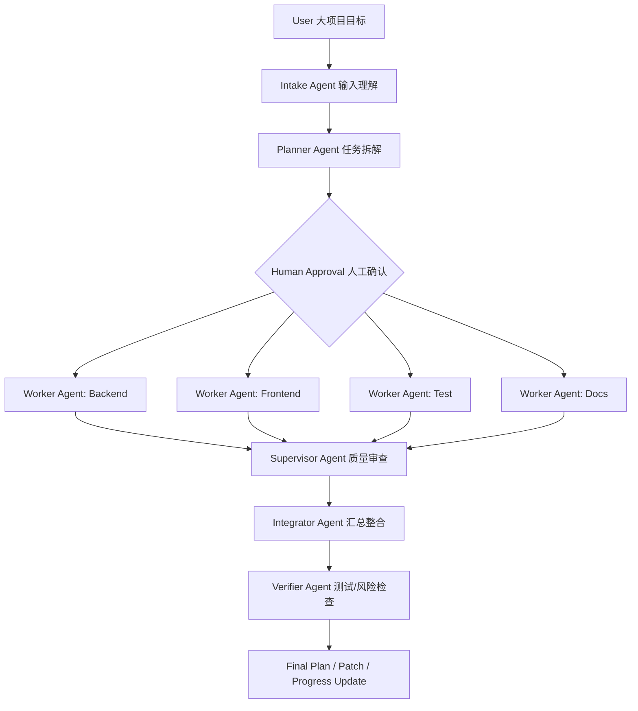

# Project Mode 实施计划

更新时间：2026-06-08

本文档把 `newidea/projectmode.md` 中的对话式想法整理为可执行的版本计划。`newidea/` 只作为本地想法暂存区，已经加入 `.gitignore`，后续新版本更新前的 idea 阶段内容都放在该目录，不进入 Git。

---

## 1. 功能定位

Project Mode 是 ModelGate 的“大项目模式”。它不是普通聊天页，也不是一次性多模型 Compare，而是面向复杂开发目标的多 Agent 协同任务控制台。

核心定位：

- 用户输入一个大目标。
- 系统把目标拆成结构化任务。
- 用户确认拆分结果。
- 多个 Worker Agent 并行产出方案、patch 或测试建议。
- Supervisor 审查冲突、遗漏和风险。
- Integrator 汇总成最终执行计划。
- 用户决定是否应用修改。

第一版不做“全自动改完整个项目”。自动写代码、自动合并、自动无限循环执行的风险太高，先把 Project Mode 做成可控的计划、审查、汇总和 artifact 生成系统。

---

## 2. 与现有模式的区别

| 模式 | 用途 | 输出 |
|---|---|---|
| Playground | 单次 prompt、单模型调用、快速测试 | 单次模型结果 |
| Compare | 同一任务多模型并排对比 | 多模型输出对比 |
| Project Mode | 大目标拆解、多 Agent 分工、持续记录、监督汇总 | 任务树、agent 输出、审查报告、最终计划、patch |
| Agent Runs | 查看每个 Agent 的任务、状态、输出、失败原因 | 运行日志和 artifact |

---

## 3. 推荐工作流



设计原则：

- 采用 orchestrator-worker 模式，避免所有 Agent 自由互聊。
- Planner 负责拆任务和定义边界，不直接写代码。
- Worker 只处理自己被分配的任务，不跨范围改动。
- Supervisor 独立审查 Worker 输出。
- Integrator 负责合并方案、处理命名和接口冲突。
- Verifier 只基于 diff、测试结果、日志做验收判断。

---

## 4. Agent 角色设计

### 4.1 Intake Agent

职责：把用户自然语言目标转成结构化需求。

输出字段：

```json
{
  "goal": "Improve API Keys page with provider health checks",
  "project_area": ["backend", "frontend", "testing"],
  "risk_level": "medium",
  "requires_repo_access": true,
  "expected_outputs": ["design plan", "patches", "tests"]
}
```

### 4.2 Planner Agent

职责：拆任务、定义依赖、定义验收标准。

限制：

- 不写代码。
- 不生成 patch。
- 必须输出结构化任务树。
- 必须列出 `allowed_files`、`acceptance_criteria`、`dependencies`。

输出字段：

```json
{
  "project_title": "API Keys Provider Health V2.1",
  "tasks": [],
  "dependencies": [],
  "parallel_groups": [],
  "acceptance_criteria": []
}
```

### 4.3 Worker Agents

预设角色：

- Backend Worker
- Frontend Worker
- Database Worker
- Test Worker
- Docs Worker
- Refactor Worker
- Security Reviewer

Worker 输出必须结构化：

```json
{
  "summary": "",
  "files_to_change": [],
  "proposed_changes": [],
  "patch": "",
  "tests": [],
  "risks": [],
  "questions": []
}
```

### 4.4 Supervisor Agent

职责：检查 Worker 结果是否可合并、是否越界、是否缺测试、是否存在安全风险。

检查项：

- 任务是否遗漏。
- Worker 输出是否互相冲突。
- 是否超出 `allowed_files`。
- 是否破坏现有架构。
- 是否需要 migration。
- 是否缺少测试。
- 是否触碰高风险文件。

输出字段：

```json
{
  "pass": false,
  "blocking_issues": [],
  "non_blocking_issues": [],
  "missing_tests": [],
  "conflicts": [],
  "next_actions": []
}
```

### 4.5 Integrator Agent

职责：合并多个 Worker 输出，形成用户能执行的最终方案。

输出内容：

- 最终修改顺序。
- 文件级修改清单。
- 接口 contract 冲突处理。
- 命名统一。
- 测试命令。
- 风险和回滚建议。
- `docs/04-开发管理/进度跟踪.md`、`设计决策.md`、`任务清单.md` 的更新建议。

### 4.6 Verifier Agent

职责：读取 diff、测试结果和日志，判断是否通过。

输出内容：

- 是否通过。
- 失败位置。
- 需要返回给哪个 Worker 修。
- 是否需要用户确认。
- 是否达到 stop condition。

---

## 5. 页面设计

### 5.1 New Project Run

用于创建大项目任务。

字段：

- Project goal
- Constraints
- Repo context
- Mode
- Budget
- Models

Mode 第一版只开放：

- Plan only
- Generate patches
- Apply with approval

暂不开放：

- Full auto

Budget 字段：

- max agents
- max rounds
- max tokens
- max runtime
- max context files

### 5.2 Task Breakdown

展示 Planner 产出的任务树，并允许用户修改。

用户可操作：

- 删除某个 Worker。
- 改 Worker 使用的模型。
- 调整任务依赖。
- 禁止某任务并行。
- 修改 `allowed_files`。
- 修改验收标准。

### 5.3 Agent Board

类似任务看板，展示每个 Agent 的状态。

卡片字段：

- role
- model
- provider
- task
- status
- input context
- output artifact
- token 消耗
- latency
- error code

### 5.4 Artifacts

所有 Agent 输出都必须文件化，不只放在聊天气泡里。

Artifact 类型：

- `plan.json`
- `backend.patch`
- `frontend.patch`
- `test-plan.md`
- `review-report.md`
- `final-implementation-plan.md`
- `progress-update.md`
- `decisions-update.md`

---

## 6. 后端数据结构草案

### 6.1 project_runs

```text
id
title
goal
status
mode
created_at
updated_at
max_agents
max_rounds
budget_tokens
planner_model_id
supervisor_model_id
integrator_model_id
```

### 6.2 project_tasks

```text
id
project_run_id
parent_task_id
title
description
role
status
priority
depends_on
allowed_files
assigned_model_id
assigned_provider_id
input_artifact_ids
output_artifact_ids
acceptance_criteria
created_at
updated_at
```

### 6.3 agent_runs

```text
id
project_run_id
task_id
role
model_id
provider_id
status
prompt
input_context
output
token_input
token_output
latency_ms
error_code
error_message
created_at
completed_at
```

### 6.4 artifacts

```text
id
project_run_id
task_id
agent_run_id
type
name
path
content
metadata
created_at
```

### 6.5 project_memory

```text
id
project_id
type
content
source
created_at
updated_at
```

Memory type：

- requirement
- decision
- constraint
- open_issue
- completed_task
- known_risk

---

## 7. 版本路线

### V2.5：Project Mode MVP（原文档 V2.2，2026-06-08 重命名）

> **注：** 因前端 V2 优化方案已使用 V2.1-V2.4，Project Mode 系列重新编号为 V2.5/V2.6/V2.7，避免冲突。

目标：先做可控的“多 Agent 协同计划系统”，不直接改代码。

范围：

- 用户输入大项目目标。
- Intake 生成结构化需求。
- Planner 拆任务。
- 用户确认任务树。
- 2-4 个 Worker 并行输出方案。
- Supervisor 审查。
- Integrator 汇总最终方案。
- 生成 progress / TODO / decision 更新建议。
- Artifacts 可查看和下载。

验收标准：

- 能创建 project run。
- 能生成结构化任务树。
- 用户能确认或修改任务树。
- Worker 输出必须进入 artifacts。
- Supervisor 能指出冲突、越界、缺测试。
- Integrator 能汇总最终执行计划。
- 全流程不会写入业务代码。

### V2.6：Patch Mode（原文档 V2.3）

目标：允许 Worker 生成 unified diff，但必须由用户确认后才能应用。

范围：

- Worker 输出 patch artifact。
- 前端展示 diff。
- 用户可选择应用、拒绝、重新生成。
- 后端校验 patch 是否触碰 `allowed_files`。
- 高风险文件自动要求二次确认。

高风险文件：

- migration
- dependency lockfile
- `.env*`
- Docker 配置
- CI 配置
- 删除文件操作

### V2.7：Controlled Auto Mode（原文档 V2.4）

目标：半自动执行 patch 和测试，但每轮受预算和停止条件控制。

范围：

- Agent 生成 patch。
- 用户确认。
- 系统 apply patch。
- 系统运行测试。
- Verifier 读取测试结果。
- 失败则分发给对应 Worker 修。

停止条件：

- 达到 `max_rounds`。
- 同一测试连续失败 2 次。
- 修改高风险文件未获用户确认。
- token 超预算。
- Worker 输出连续 2 次不满足 schema。

---

## 8. 模型分配策略

简单策略：

| 角色 | 推荐模型类型 |
|---|---|
| Planner | 最强 reasoning model |
| Backend Worker | 最强 coding model |
| Frontend Worker | 擅长 React / UI 的 coding model |
| Test Worker | 便宜但稳定的 coding model |
| Supervisor | 最强 reasoning / review model |
| Docs Worker | 便宜文本模型 |
| Integrator | 稳定长上下文模型 |

后续可以把 Capability Router 升级为 Agent Assignment Router：

```json
{
  "task_type": "backend",
  "required_capabilities": ["coding", "long_context"],
  "preferred_traits": ["low_failure_rate", "high_reasoning"],
  "budget": "medium"
}
```

---

## 9. 风险与控制

| 风险 | 控制方式 |
|---|---|
| 并行任务接口假设冲突 | Planner 先定义 contract，Supervisor 检查一致性 |
| Agent 越界修改 | 每个 task 指定 `allowed_files`，越界 patch 标红 |
| token 成本失控 | 设置 max agents、max rounds、max tokens、max context files |
| 产物无法合并 | V2.2 只生成方案，V2.3 才生成 patch |
| 自动执行改坏项目 | V2.4 仍保留用户确认和 stop condition |
| 缺少项目记忆 | 每轮生成 progress、decision、TODO 更新建议 |

---

## 10. 当前执行建议

下一版路线建议：

1. 前端 V2.1-V2.4 已完成（见 `docs/05-前端设计/前端V2界面与功能优化方案.md`）。
2. 进入 V2.5 Project Mode MVP（2026-06-08 启动，本文档定义）。
3. V2.5 完成后，再评估是否进入 V2.6 Patch Mode。

Project Mode 不应替代现有 Playground / Compare，而应作为更高层的大项目控制台，复用现有 Provider、Model Registry、Capability Router、Usage、Activity 和日志能力。
